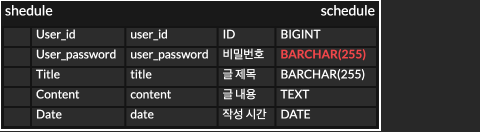

## 📌 API 명세서

| 기능    | Method | URL               | Request Body                                                                           | Response Body                                                                | 상태코드           |
| ----- | ------ | ----------------- | -------------------------------------------------------------------------------------- | ---------------------------------------------------------------------------- | -------------- |
| 일정 생성 | POST   | `/schedules`      | `{ "title": "운동", "content": "조깅", "date": "2025-05-20", "password": "1234" }`         | `{ "id": 1, "title": "운동", "content": "조깅", "date": "2025-05-20" }`          | 201 Created    |
| 일정 조회 | GET    | `/schedules/{id}` |                                                                                        | `{ "id": 1, "title": "운동", "content": "조깅", "date": "2025-05-20" }`          | 200 OK         |
| 전체 조회 | GET    | `/schedules`      |                                                                                        | `[ { "id": 1, "title": "운동", "content": "조깅", "date": "2025-05-20" }, ... ]` | 200 OK         |
| 일정 수정 | PUT    | `/schedules/{id}` | `{ "title": "변경된 제목", "content": "변경된 내용", "date": "2025-05-21", "password": "1234" }` | `{ "id": 1, "title": "변경된 제목", "content": "변경된 내용", "date": "2025-05-21" }`  | 200 OK         |
| 일정 삭제 | DELETE | `/schedules/{id}` | `{ "password": "1234" }`                                                               |                                                                              | 204 No Content |

## 📌 ERD

